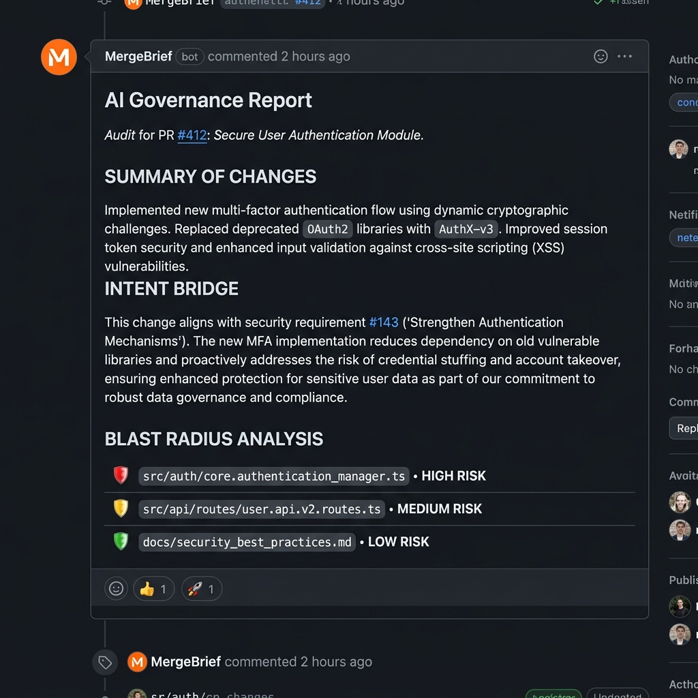

# 🛡️ MergeBrief: The AI Governance Layer

**AI PR Risk Triage + Auditable Approval Evidence.**

MergeBrief is an open-source governance control plane designed for modern engineering teams. It solves "AI Review Inflation" by providing high-fidelity risk triage, semantic intent analysis, and auditable evidence for AI-assisted code contributions.


---

## ✨ Key Features

### 🎯 High-Fidelity Risk Triage
Automatically classify Pull Requests as **Trivial**, **Standard**, or **High-Risk**. MergeBrief combines deterministic signals (commit trailers) with LLM-assisted verification to identify potential security or logic flaws in AI-generated code.

### 🌉 Intent Bridge
Capture developer intent automatically. MergeBrief generates "Merge Notes" that explain *what* changed, *why* the AI was used, and the *verification steps* taken, reducing reviewer friction by up to 40%.

### 📄 Compliance-Ready Artifacts
Every governance decision generates a "Certificate of Review"—a timestamped audit trail that satisfies enterprise compliance requirements for AI-contributed code.



---

## 🚀 Why MergeBrief?

| Benefit | How we do it |
| :--- | :--- |
| **Maintain Velocity** | AI-suggested summaries and "Intent Bridges" speed up review cycles. |
| **Enhance Security** | "Blast Radius" analysis highlights AI changes in critical security modules. |
| **Audit Readiness** | Permanent, signed records of every AI-assisted code approval. |
| **Flexible Policy** | Toggle between **Observe**, **Advisory**, and **Block** modes. |

---

## 📦 Deployment Modes

MergeBrief adapts to your stack with three powerful integration levels:

1. **Dashboard (Full Stack)**: Next.js + Express + PostgreSQL. Centralized control plane for the whole organization.
2. **GitHub Action**: Zero-config governance for individual repositories.
3. **CLI Tool**: Powerful ad-hoc audits for local development or custom CI/CD pipelines.


---

## ⚡ Quick Start (Docker)

The fastest way to get MergeBrief running in your environment is using Docker:

```bash
# 1. Clone the repository
git clone https://github.com/aincloudtools/AI-Provenance.git
cd AI-Provenance

# 2. Run the setup script
chmod +x ./scripts/setup.sh
./scripts/setup.sh
```

For detailed setup instructions, including GitHub App configuration, see the **[📦 Installation Guide](./docs/INSTALL.md)**.

---

## 📚 Documentation

- [📦 Installation Guide](./docs/INSTALL.md) - Step-by-step Docker setup.
- [⚙️ Configuration Guide](./docs/CONFIG.md) - GitHub App and environment setup.
- [🚀 Usage Guide](./docs/USAGE.md) - How to use the dashboard and CLI.
- [🏢 Production Deployment](./docs/PRODUCTION_DEPLOYMENT.md) - Scaling for enterprise.

---

## 🤝 Contributing

We welcome contributions! MergeBrief is open-source and built for the community. Please see our [Contributing Guidelines](CONTRIBUTING.md) to get started.

---

## ⚠️ Notes

- **Privacy**: MergeBrief processes diffs locally or within your private VPC. Your code never leaves your controlled environment.
- **AI Models**: Supports Anthropic Claude-3 and OpenAI GPT-4 for high-fidelity analysis.

---

*Built with ❤️ by the AI Provenance team.*
